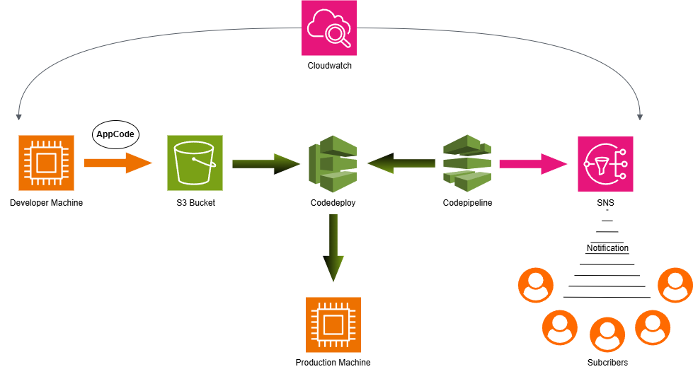

# CI/CD Pipeline with AWS CodePipeline, CodeDeploy, and S3

## Overview
This document describes how to set up a **CI/CD pipeline** using **AWS CodePipeline** and **AWS CodeDeploy** with **Amazon S3** as the source repository. The pipeline will automatically deploy new versions of the code to a target web server whenever a new version is uploaded to the S3 bucket.

## Architecture
1. **Amazon S3** - Stores the application package.
2. **AWS CodePipeline** - Detects changes in the S3 bucket and triggers deployments.
3. **AWS CodeDeploy** - Deploys the application to the target web server.
4. **Amazon CloudWatch** - Monitors the pipeline and deployment events.

## Prerequisites
- An **AWS account** with access to CodePipeline, CodeDeploy, and S3.
- An **S3 bucket** to store application artifacts.
- An **EC2 instance** (or other server) set up as a deployment target.
- An **IAM role** with the necessary permissions for CodePipeline and CodeDeploy.

---

## Step 1: Create an S3 Bucket for Artifacts
1. Navigate to the **AWS S3 Console**.
2. Create a new bucket (e.g., `sampleapp2702`).
3. Enable **versioning** for tracking changes.
4. Copy the bucket name; you will use it in later steps.

---

## Step 2: Configure AWS CodeDeploy
1. Go to the **AWS CodeDeploy Console**.
2. Click **Create application**.
3. Enter an **Application name** (e.g., `sampleapp`).
4. Under **Compute platform**, select `EC2/On-premises`.
5. Click **Create deployment group** and configure:
   - **Deployment Group Name**: `mydpgrp`
   - **Service Role**: Select or create an IAM role with CodeDeploy permissions.
   - **Deployment Type**: `In-place deployment`
   - **Environment Configuration**: Choose the EC2 instances to deploy to.
   - **Load Balancer**: (Optional) Attach a load balancer if required.
6. Click **Create Deployment Group**.

---

## Step 3: Configure AWS CodePipeline
1. Navigate to **AWS CodePipeline**.
2. Click **Create Pipeline** and provide:
   - **Pipeline Name**: `app-pipeline`
   - **Service Role**: Choose an existing IAM role or create a new one.
3. In the **Source Stage**:
   - Choose **Amazon S3** as the source provider.
   - Select the S3 bucket where the application package is stored.
   - Enable event notifications to trigger deployments automatically.
4. In the **Deploy Stage**:
   - Choose **AWS CodeDeploy**.
   - Select your application and deployment group.
5. Click **Create Pipeline**.

---

## Step 4: Upload New Code to S3
1. Package your application and create a `appspec.yml` file for CodeDeploy.
2. Upload the package to the S3 bucket.
3. AWS CodePipeline will detect the new version and trigger the deployment.

---

## Step 5: Deploy and Test
1. Check the **AWS CodePipeline Console** for pipeline execution status.
2. Monitor the **AWS CodeDeploy Console** for deployment progress.
3. Verify that the application is updated on the web server.

---

## Rollback and Monitoring
- **Automatic Rollback**: CodeDeploy is configured to rollback on failure.
- **CloudWatch Monitoring**: Use CloudWatch logs to debug issues.
- **SNS Notifications**: Set up AWS SNS to get alerts for failed deployments.

## Conclusion
This setup automates deployments from an S3 bucket to an EC2 instance using AWS CodePipeline and CodeDeploy. Any new version uploaded to the bucket triggers an automatic deployment, reducing manual intervention and improving deployment efficiency.

